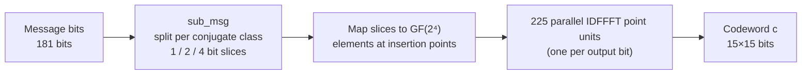
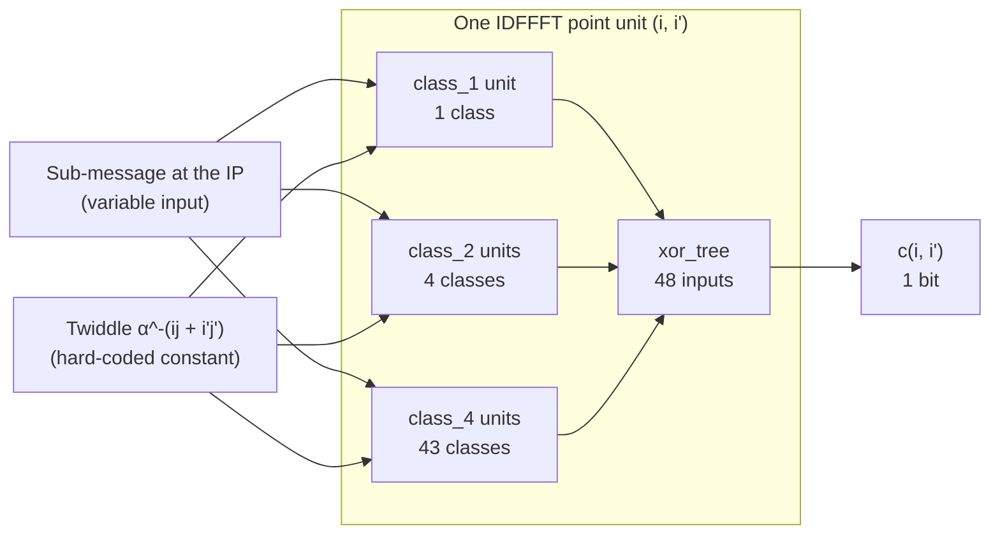
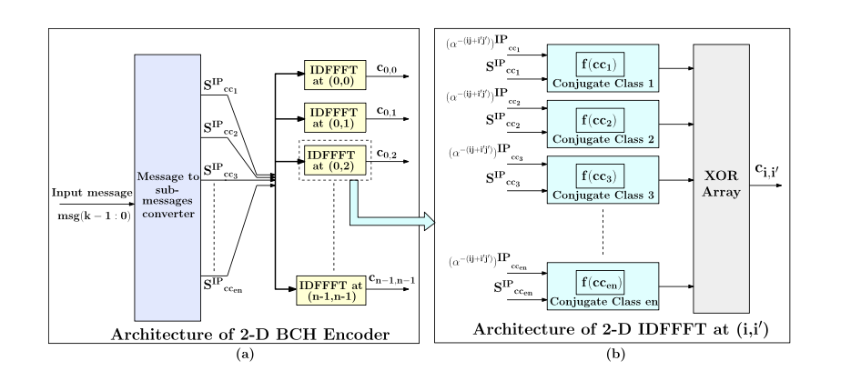
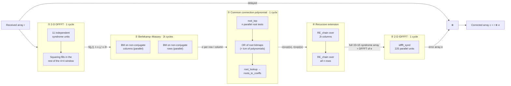
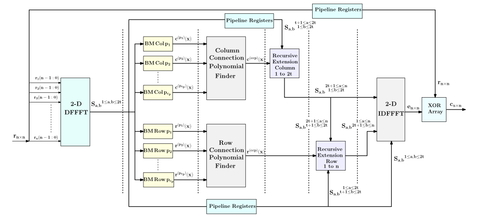
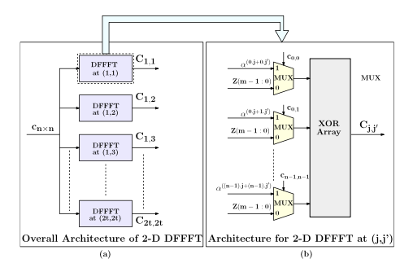
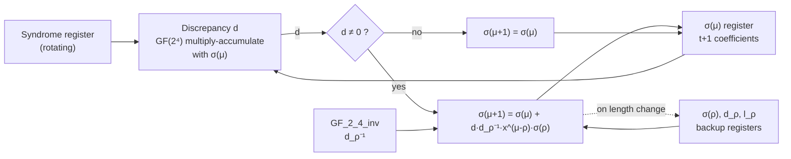
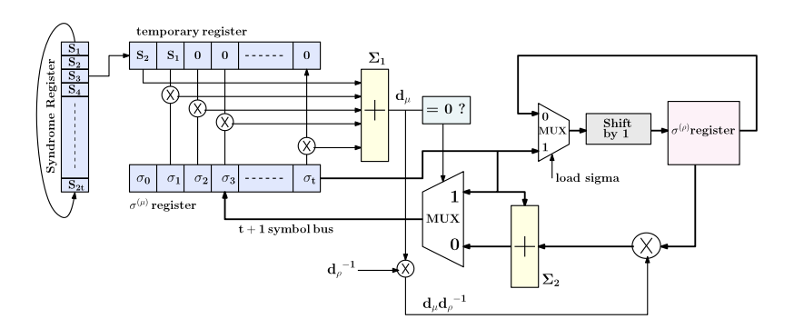
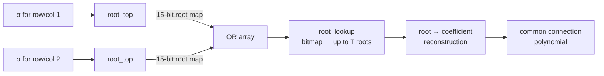

# 2-D BCH Codec in the Frequency Domain

A Verilog implementation of a fully parallel **encoder** and a pipelined **decoder** for two-dimensional
Bose–Chaudhuri–Hocquenghem (BCH) codes, built on the frequency-domain architecture of

> A. Mondal and S. S. Garani, "Efficient Hardware Architectures for 2-D BCH Codes in the Frequency Domain
> for Two-Dimensional Data Storage Applications," *IEEE Transactions on Magnetics*, vol. 57, no. 5, May 2021.
> [DOI: 10.1109/TMAG.2021.3060807](https://doi.org/10.1109/TMAG.2021.3060807)


The design targets the paper's worked example, a **15×15, t = 2** code over GF(2⁴), and is structured so that
other (n, t) choices need parameter changes rather than a redesign, except where noted under
[Known limitations](#known-limitations).

---

## Highlights

| | |
|---|---|
| **Code** | 15×15 binary 2-D BCH, corrects any quasi-cyclic burst up to 2×2, rate **181/225** |
| **Field** | GF(2⁴), primitive polynomial x⁴ + x + 1 |
| **Encoder** | Fully parallel, one codeword per cycle, IDFFFT reduced by conjugacy-class algebra |
| **Decoder** | Six pipeline stages, target latency **2t + 5 = 9 cycles**, one codeword every **2t = 4 cycles** |
| **FPGA result** | **6,008 LUTs · 1,324 FFs · 0 BRAM · 0 DSP**, timing met at 100 MHz with +0.659 ns slack (Vivado) |
| **Verification** | Module-level testbenches checked against independent Python models and the paper's worked examples |

---

## Contents

1. [Background](#background)
2. [Code parameters](#code-parameters)
3. [Architecture](#architecture)
4. [Module reference](#module-reference)
5. [Implementation results](#implementation-results)
6. [Verification](#verification)
7. [Building and running](#building-and-running)
8. [Design notes](#design-notes)
9. [Known limitations](#known-limitations)
10. [Repository structure](#repository-structure)
11. [Figure credits](#figure-credits)
12. [References](#references)

---

## Background

### Why 2-D codes?

Two-dimensional magnetic recording (TDMR), shingled recording, and 3-D NAND produce errors that are clustered
in **two dimensions**. A 1-D code protects a stream, whereas a 2-D BCH code protects an n×n array and can fix a
square burst in a single pass. Compared with a product of two 1-D BCH codes of the same 15×15 size, the 2-D BCH
code has a much better rate (181/225 versus 49/225 for the (15,7) product code) and does not need to know whether
a burst lies along a row or a column.

### Frequency-domain coding in one paragraph

A 2-D codeword **c** is defined by its spectrum **C** (the 2-D discrete finite-field Fourier transform, DFFFT):

$$C_{j,j'} = \sum_{i=0}^{n-1}\sum_{i'=0}^{n-1} \alpha^{ij}\,\beta^{i'j'}\,c_{i,i'}$$

The code is the set of arrays whose spectrum is **zero** at the 2t × 2t positions `1 ≤ j, j' ≤ 2t`. That
guarantees correction of any t×t quasi-cyclic burst. Because the codeword is binary, the spectrum must also
satisfy the **conjugacy constraint**

$$C_{2j,\2j'} = C_{j,j'}^{\,2}$$

which splits the 225 spectral positions into **59 conjugate classes** (11 classes of forced zeros, 48 classes that
carry the message). Only one position per class (the *insertion point*, IP) carries independent information. The
rest follow by repeated squaring in GF(2⁴). Almost every optimisation in this design comes from that one fact.

> A *quasi-cyclic burst of size t×t* means at most **t distinct rows and t distinct columns** contain errors.
> They need not be physically adjacent, and the burst may wrap around the array edges.

---

## Code parameters

| Parameter | Value |
|---|---|
| Array size n × n | 15 × 15 |
| Burst capability t × t | 2 × 2 |
| Extension field | GF(2⁴), p(x) = x⁴ + x + 1 |
| Spectral nulls | 44 positions (the 4×4 window plus conjugates), 11 conjugate classes |
| Message positions | 181 bits in 48 conjugate classes (1 of size 1, 4 of size 2, 43 of size 4) |
| Rate | 181 / 225 ≈ 0.804 |
| Minimum distance | ≥ 2t + 1 = 5 |

---

## Architecture

### Encoder

The encoder places each sub-message at its class's insertion point, derives the rest of the spectrum by
conjugacy, and evaluates the 2-D IDFFFT at **all 225 output points in parallel**.



Inside each of the 225 IDFFFT point units (`idffft_top`), one small unit per message conjugate class computes a
single bit, and an XOR tree combines them. The twiddle factor for each (class, output point) pair is a
**constant**, hard-wired at design time rather than computed.



**Why this is cheap.** The output is a *single bit*, so for a class of size 4 or 2 only the MSB of the
GF(2⁴) product at the insertion point is needed (paper eqs. 10 and 11). That reduces each class unit to a handful
of AND/XOR gates (5 AND + 4 XOR for size 4, 6 AND + 5 XOR for size 2). The paper reports roughly a **94 %
reduction in gates per IDFFFT point** compared with the brute-force evaluation.

#### Reference figure from the paper

<p align="center">
  
</p>

*Paper Fig. 5. (a) Encoder architecture: a message-to-sub-messages converter feeding n² parallel IDFFFT units.
(b) The IDFFFT block at a point (i, i'): one conjugate-class unit per message class, combined by an XOR array.
Reproduced from Mondal and Garani (2021); see [Figure credits](#figure-credits).*

### Decoder

The decoder follows the paper's modified Blahut algorithm (Algorithm 3). A 2t × 2t window of syndromes is
enough to determine the error, so the decoder never computes a full forward transform.



| Stage | Task | Cycles | Notes |
|---|---|---|---|
| ① DFFFT | Syndromes over the 2t × 2t window | 1 | Only the 11 independent syndromes are computed from `r`; the other 5 come from squaring |
| ② BM | Locator polynomial for each non-conjugate row and column | 2t | Conjugate rows/columns share a polynomial, so only c_p engines per direction are needed |
| ③ CCP | Merge polynomials into one common polynomial | 1 | Union of root sets = roots of the lcm, found with an OR array instead of polynomial arithmetic |
| ④ RE | Extend 2t known syndromes to all n | 2 | Cascaded RE base cells (`n − 2t` multiply-accumulate stages) |
| ⑤ IDFFFT | Error array in the time domain | 1 | Same conjugacy trick as the encoder |
| | **Latency (target)** | **2t + 5 = 9** | |

#### Reference figures from the paper

<p align="center">
  
</p>

*Paper Fig. 8. Top-level decoder: 2-D DFFFT, parallel BM engines on non-conjugate columns and rows, column and
row connection polynomial finders, recursive extension (columns, then rows), 2-D IDFFFT, and a final XOR with the
delayed received array. Dotted lines mark the pipeline-register boundaries.*

<p align="center">
  
</p>

*Paper Fig. 9. (a) The 2-D DFFFT finder: 2t × 2t parallel DFFFT units. (b) One DFFFT unit: n² multiplexers select
either the constant α^(ij+i'j') or zero depending on the input bit, and an XOR array sums the results.*

#### Berlekamp–Massey engine

Each BM engine runs `2t` iterations. Per iteration it computes the discrepancy `d`, and if `d ≠ 0` updates the
locator polynomial using the stored copy from the last length change. The architecture keeps `σ(ρ)` pre-multiplied
by `x`, so the update never needs a barrel shifter.



<p align="center">
  
</p>

*Paper Fig. 10. BM engine datapath: rotating syndrome register and "temporary register" produce the discrepancy
d<sub>μ</sub> through adder Σ₁; adder Σ₂ and the d<sub>μ</sub>·d<sub>ρ</sub>⁻¹ multiplier update σ<sup>(μ)</sup>,
while σ<sup>(ρ)</sup> is stored pre-shifted by x to avoid a barrel shifter.*

#### Common connection polynomial finder

Instead of multiplying polynomials to get an lcm, the design finds each polynomial's **roots** in parallel and ORs
the root bitmaps. The union of roots is the root set of the lcm. The roots are then expanded back into
coefficients (`roots_to_coeffs.v` for general T, `root_to_coeff_comb.v` for the combinational T = 2 case).



#### Recursive extension

With a connection polynomial `c(x)` of degree t, each unknown syndrome is a linear recurrence on its
predecessors:

$$S_{j,j'} = \sum_{\mu=1}^{t} c_\mu \, S_{(j-\mu)\bmod n,\;j'}$$

One RE base cell is t GF multipliers plus an XOR array. `RE_chain` cascades `n − 2t` cells so that an entire
row or column is extended combinationally. If timing needs it, the chain can be split across two cycles at the
cost of one extra cycle of latency.

### Pipeline schedule

BM is the only multi-cycle stage, so it sets the initiation interval: a new codeword enters every **2t = 4 cycles**.

| Cycle | 1 | 2 | 3 | 4 | 5 | 6 | 7 | 8 | 9 | 10 | 11 | 12 | 13 |
|---|---|---|---|---|---|---|---|---|---|---|---|---|---|
| **Codeword 1** | DFFFT | BM | BM | BM | BM | CCP | RE | RE | IDFFFT | | | | |
| **Codeword 2** | | | | | DFFFT | BM | BM | BM | BM | CCP | RE | RE | IDFFFT |

*This is the schedule the architecture is designed for. See [Known limitations](#known-limitations) for the
current status of back-to-back operation.*

---

## Module reference

| Folder | Module | Role |
|---|---|---|
| `common/` | `GF_2_4_mult.v` | GF(2⁴) multiplier |
| | `GF_2_4_inv.v` | GF(2⁴) inverse (look-up table) |
| | `gf16_square.v` | GF(2⁴) squaring (Frobenius map, linear, so it is just XORs) |
| | `xor_tree.v`, `or_tree.v` | Parameterised balanced reduction trees |
| | `roots_to_coeffs.v` | Sequential root → polynomial reconstruction, any T |
| | `root_to_coeff_comb.v` | Combinational, `num_found`-aware reconstruction for T = 2 |
| `DFFFT/` | `dffft_unit.v` | One spectral point: mux + XOR tree over the input array |
| | `dffft_top.v` | 2t × 2t syndrome array using conjugacy to avoid redundant units |
| `BM_engine/` | `BM_top.v` | Core Berlekamp–Massey iteration (2t cycles) |
| | `BM_interface.v` | Streams a 2t-wide syndrome bus into `BM_top` one symbol per cycle |
| `root_finder/` | `poly_i.v` | Tests one field element as a root of σ(x) |
| | `root_top.v` | n parallel `poly_i` → root-position bitmap |
| | `root_lookup.v` | Extracts up to T root values from a bitmap |
| `ccp/` | `ccp_top.v` | **Top-level decoder** wiring all stages together |
| `recursive_extension/` | `RE_chain.v` | Cascaded RE base cells |
| `IDFFFT/` | `class_1.v`, `class_2.v`, `class_4.v` | Per-class reduced multiply units (paper eqs. 9–11) |
| | `idffft_top.v` | One output-point IDFFFT unit |
| | `idffft_synd.v` | Full n × n error-array reconstruction |
| `encoder/` | `sub_msg.v` | Splits the message across conjugate classes; uses `IDFFFT/` modules |

---

## Implementation results

Post-implementation results for the decoder core `ccp_top` on a **Xilinx Kintex-7 xc7k325tffg900-2**
(the KC705 device), synthesised and implemented with **AMD Vivado 2026.1** against a 100 MHz clock constraint.

### Resource utilisation

| Resource | Used | Available | Utilisation |
|---|---:|---:|---:|
| Slice LUTs | 6,008 | 203,800 | 2.95 % |
| ↳ LUT as logic | 5,782 | 203,800 | 2.84 % |
| ↳ LUT as shift register (SRL) | 226 | 64,000 | 0.35 % |
| Slice registers | 1,324 | 407,600 | 0.32 % |
| Occupied slices | 1,702 | 50,950 | 3.34 % |
| Block RAM tiles | **0** | 445 | 0.00 % |
| DSP48E1 | **0** | 840 | 0.00 % |
| Bonded IOBs | 454 | 500 | 90.80 % |
| BUFG | 1 | 32 | 3.13 % |

The decoder is built entirely from fabric logic. GF(2⁴) arithmetic is combinational, and the 226 SRLs come from
shift-register structures (syndrome and pipeline delay). Nothing is left unrouted on the embedded RAM, so a
system integrator keeps all BRAM and DSP slices.

> The 454 bonded IOBs are consistent with a 225-bit input array, a 225-bit output array, and a few control
> pins, i.e. the core was implemented standalone with its full parallel interface on package pins. Putting it
> behind a bus wrapper (for example AXI-Stream with a serial-in/serial-out shim) is the intended way to deploy it.

### Timing (100 MHz target, 10.000 ns)

| Metric | Value | Failing endpoints |
|---|---:|---:|
| Worst negative slack (WNS) | **+0.659 ns** | 0 |
| Total negative slack (TNS) | 0.000 ns | 0 |
| Worst hold slack (WHS) | +0.061 ns | 0 |
| Total hold slack (THS) | 0.000 ns | 0 |
| Worst pulse-width slack (WPWS) | +4.358 ns | 0 |

All 1,423 endpoints meet setup, hold, and pulse-width requirements.

$$T_{min} = T_{target} - WNS = 10.000 - 0.659 = 9.341\ \text{ns} \quad\Rightarrow\quad f_{max} \approx 107\ \text{MHz}$$

> **Reading the f_max number.** This is derived from slack at a 100 MHz constraint. Vivado stops optimising once
> timing is met, so ~107 MHz is a conservative lower bound, not a sweep result. Re-running with a tighter
> constraint (for example 125 to 150 MHz) is the way to find the true limit.

### Throughput

Using the paper's definition, one decoded 225-bit array every 2t cycles:

$$\text{Throughput} = \frac{n^2 \cdot f_{clk}}{2t} = \frac{225 \cdot f_{clk}}{4}$$

| Clock | Throughput |
|---|---:|
| 100 MHz | 5.63 Gb/s |
| 107 MHz (timing-derived) | 6.02 Gb/s |

These are *architectural* figures that assume the pipeline accepts a new codeword every 4 cycles. Measured
latency and initiation interval from simulation: **TBD**.

### Comparison with the reference paper

The paper's decoder was implemented on the same Kintex-7 family (KC-705 kit) using Xilinx ISE, whereas this work
uses a modern Vivado release, so the tool flows differ and the numbers are only indicative.

| Metric | Paper (ISE) | This work (Vivado 2026.1) | Δ |
|---|---:|---:|---:|
| Slice LUTs | 4,993 | 6,008 | +20 % |
| Slice registers | 1,082 | 1,324 | +22 % |
| f_max | 111.36 MHz (post-PAR) | ≈ 107 MHz (from slack at 100 MHz) | −4 % |
| Decoder latency (cycles) | 9 | TBD (measure in simulation) | |
| Throughput at 100 MHz | 5.6 Gb/s | 5.63 Gb/s (architectural) | |

The implementation lands in the same ballpark as the published design. The extra LUT and register usage is
plausible given a different synthesis flow and a from-scratch implementation. Per-module attribution from
Vivado's hierarchical utilisation report will show where it goes, and `idffft_synd` is expected to dominate.

### Encoder results

Encoder utilisation and timing: **TBD**. The paper reports 720 LUTs, 225 registers, and a one-cycle latency for
its encoder.

---

## Verification

Every core module was developed with a self-contained testbench and checked against an **independent Python
reference model** and/or worked examples from the literature before being integrated.

| Block | Testbench location | Checked against | Status |
|---|---|---|---|
| `GF_2_4_mult`, `GF_2_4_inv` | `common/` | Python GF(2⁴) tables | TBD |
| `BM_top` | `BM_engine/` | Python BM model; Lin & Costello worked example (Table 3.4) | TBD |
| `dffft_top` | `DFFFT/` | Python 2-D DFFFT | TBD |
| `poly_i` / `root_top` | `root_finder/` | Python root search | TBD |
| `RE_chain` | `recursive_extension/` | Python recurrence | TBD |
| `roots_to_coeffs` | `common/` | Python polynomial expansion | TBD |
| `idffft_*` / encoder | `IDFFFT/`, `encoder/` | Paper's 15×15 encoding example (Figs. 3–4) | TBD |
| `ccp_top` (end to end) | `ccp/` | Python full encode → corrupt → decode | TBD |

<!-- Replace each TBD with: pass count / number of vectors, e.g. "PASS (2,000 random bursts)". -->

**What the end-to-end test should cover** (fill in what is actually run):

- zero errors (decoder must be transparent),
- every single-bit error,
- random t × t bursts, including ones that wrap around the array edges,
- non-adjacent quasi-cyclic patterns (2 rows × 2 columns, not touching),
- a pattern *beyond* t × t, to document how the decoder fails.

---

## Building and running

**Requirements:** [Icarus Verilog](http://iverilog.icarus.com/) (`iverilog`, `vvp`), Python 3 with NumPy for the
hex-file generators. [GTKWave](https://gtkwave.sourceforge.net/) is optional for waveforms.

Several modules (`dffft_unit`, `poly_i`, `idffft_top`, …) load their GF(2⁴) power-table constants at elaboration
time with `$readmemh`, so the generated `.hex` files must be present in the simulation's working directory.

```bash
# 1. Generate the constant tables      (TBD: script name and location)
python3 scripts/gen_hex.py

# 2. Run a single module's testbench   (TBD: exact file names)
iverilog -g2012 -o sim_bm  BM_engine/BM_top.v BM_engine/tb_BM_top.v
vvp sim_bm

# 3. Run the full decoder
iverilog -g2012 -o sim_ccp ccp/*.v common/*.v DFFFT/*.v BM_engine/*.v \
         root_finder/*.v recursive_extension/*.v IDFFFT/*.v
vvp sim_ccp
```

<!-- TODO: replace with a Makefile so `make test` runs everything. -->

### Reproducing the FPGA results

1. Create a Vivado project for part `xc7k325tffg900-2` with `ccp_top` as the top module.
2. Add a 100 MHz clock constraint on the clock port (`create_clock -period 10.000`).
3. Run synthesis and implementation, then `report_utilization` and `report_timing_summary`.

---

## Design notes

- **GF(2⁴) convention.** Field elements are 4-bit vectors with `a0` as the **most significant** bit, using
  p(x) = x⁴ + x + 1. Python models must use the same ordering.
- **Conjugacy is used on both sides.** The same fact (`C²_{j,j'} = C_{2j,2j'}`) shrinks the DFFFT, the IDFFFT,
  and the BM stage. Conjugate rows and columns satisfy the *same* connection polynomial, so BM only runs on one
  representative per class (paper Remark 6).
- **Recursive extension runs on every known row and column**, not only on the BM representatives. Conjugacy cuts
  BM work, but RE needs actual syndrome values for each row and column it extends.
- **Parallel BM with an OR-based lcm.** The original IBA-I runs BM serially, feeding each result into the next.
  Here the engines run in parallel and the common polynomial is built from the union of roots, which is what
  makes the 2t-cycle BM stage possible.
- **Two root-to-coefficient implementations.** `roots_to_coeffs.v` is general in T but multi-cycle.
  `root_to_coeff_comb.v` is combinational for T = 2 and relies on hand-derived per-case formulas (see below).
- **Hard-wired twiddles.** The values `α^−(ij + i'j')` depend only on constants known at design time, so they are
  baked into the logic instead of computed.

---

## Known limitations

- `root_to_coeff_comb.v` is specific to **T = 2**. Larger T needs the case-split formulas re-derived, or the
  sequential `roots_to_coeffs.v` with its extra latency.
- Resource use is dominated by `idffft_synd`, whose instance count scales as `N × N × TOTAL_CLASSES`. This matches
  the paper's own breakdown of the decoder (Section V, Table IV) and is not an implementation regression.
- **Back-to-back decoding.** Streaming codewords with no idle gap has surfaced pipeline-depth mismatches during
  development. Single-codeword decoding is verified; the sustained 1-codeword-per-4-cycles rate needs
  re-verification after any change to a stage's cycle count.
- Timing was closed at 100 MHz; a frequency sweep has not been done (see the f_max note above).
- Results cover the decoder only; encoder implementation numbers are not yet reported.

## Planned work

- Randomised, self-checking regression with a C++/Verilator or cocotb scoreboard driven by the Python model
- Tighter timing sweep to establish true f_max
- AXI-Stream wrapper so the core can be deployed without 450 I/O pins
- Encoder implementation results
- Extension to 3-D codes (stacked 2-D codes for t × t × n bursts)

---

## Repository structure

```
.
├── common/                GF(2^4) primitives and reduction trees
├── DFFFT/                 forward transform (syndrome computation)
├── BM_engine/             Berlekamp–Massey engine and interface
├── root_finder/           root search over GF(2^4)
├── recursive_extension/   RE_chain
├── IDFFFT/                inverse transform, per-class units
├── encoder/               message splitting + codeword generation
├── ccp/                   top-level decoder (ccp_top.v)
└── README.md
```

---

## Figure credits

Figures 5, 8, 9, and 10 under `docs/figures/` are taken from Mondal and Garani (2021), © IEEE, and are included
here only to document the architecture this code implements. All other diagrams in this README are original.
The paper itself is available at [doi.org/10.1109/TMAG.2021.3060807](https://doi.org/10.1109/TMAG.2021.3060807).

---

## References

1. A. Mondal and S. S. Garani, "Efficient hardware architectures for 2-D BCH codes in the frequency domain for
   two-dimensional data storage applications," *IEEE Trans. Magn.*, vol. 57, no. 5, 2021.
2. H. S. Madhusudhana and M. U. Siddiqi, "On Blahut's decoding algorithms for two-dimensional BCH codes,"
   *IEEE Trans. Inf. Theory*, vol. 44, no. 1, pp. 358–367, 1998.
3. R. E. Blahut, "Transform techniques for error control codes," *IBM J. Res. Develop.*, vol. 23, no. 3,
   pp. 299–315, 1979.
4. H. Imai, "A theory of two-dimensional cyclic codes," *Inf. Control*, vol. 34, no. 1, pp. 1–21, 1977.
5. S. Lin and D. J. Costello, *Error Control Coding*, 2nd ed., Prentice-Hall, 2004.

## Acknowledgments

The architecture and algorithms follow Mondal and Garani (2021). Any implementation errors, simplifications, or
deviations from the paper are the author's own and are noted in module comments where significant.
